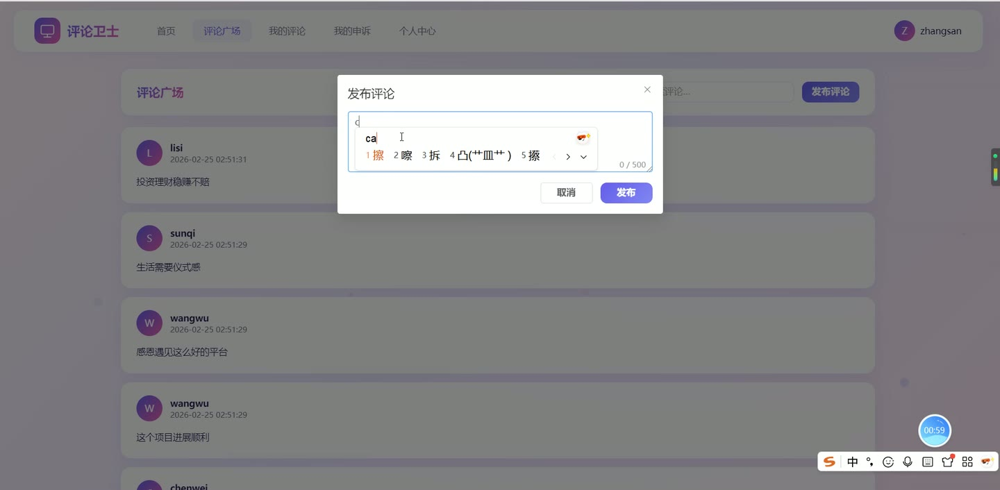
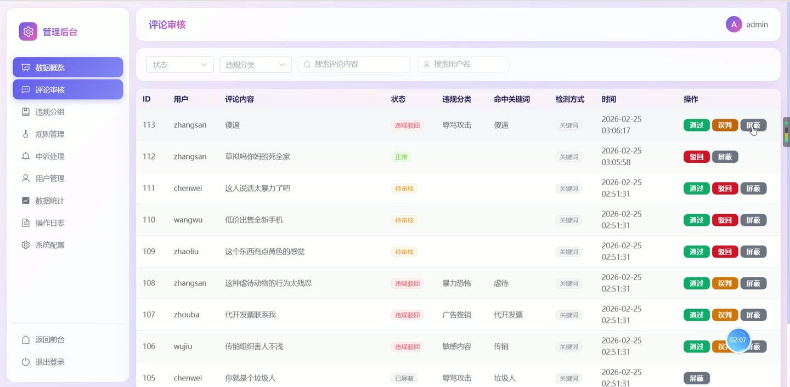

# (附文档)Python+Django+Vue3 网络评论

**技术栈**：Python、Django、机器学习、Vue3、MySQL

### 系统简介

本系统是一套基于 Django + Vue3 前后端分离架构的网络评论智能审核平台，内置关键词匹配与机器学习辅助双模式违规检测引擎。系统分为普通用户端与管理员端两类角色，普通用户可发布评论、查看个人评论与申诉记录，管理员可对评论进行审核、处理申诉、维护违规规则、管理用户并查看统计报表。
 
### 核心功能
 
### 普通用户端

 
- 账号注册：填写用户名、手机号、密码与确认密码，并通过图形验证码校验后完成注册。 
- 账号登录：输入用户名与密码登录，系统校验密码并判断账号状态，被禁用账号将提示无法登录。 
- 重置密码：通过用户名与注册手机号校验身份后设置新密码。 
- 个人中心：查看个人资料，修改手机号、邮箱、头像及登录密码。 
- 发布评论：在评论广场填写评论内容并提交，系统实时进行违规检测，命中违规将直接驳回并提示。 
- 评论广场浏览：查看全部正常状态评论列表，支持按关键词搜索与分页浏览。 
- 我的评论：查看本人发布的全部评论，支持按状态、关键词筛选与分页。 
- 删除评论：对本人评论执行删除操作。 
- 提交申诉：对被驳回的评论填写申诉理由提交申诉，同一评论存在待处理申诉时不可重复提交。 
- 我的申诉：查看本人提交的申诉记录，包含申诉理由、处理状态、处理说明与处理时间。 
- 文件上传：上传图片文件并返回可访问的图片地址。
 
### 管理员端

 
- 数据看板：查看总评论数、违规评论数、注册用户数、待处理申诉数四项指标，并展示违规评论趋势折线图、违规类型分布饼图与自动识别准确率。 
- 评论审核：按状态、违规分类、评论内容关键词、用户名筛选评论列表，对评论执行通过、驳回、误判操作，并记录审核人与审核时间。 
- 屏蔽评论：将指定评论状态置为已屏蔽。 
- 违规分组查看：按违规分类分组展示各分类下的违规与已屏蔽评论及数量统计。 
- 申诉处理：按状态筛选申诉列表，对申诉执行通过或驳回，填写处理说明，通过后自动恢复对应评论为正常状态。 
- 违规分类管理：新增、编辑、删除违规分类，并通过开关启用或禁用分类。 
- 违规关键词管理：新增、编辑、删除关键词，设置所属分类、权重与启用状态，支持按分类与关键词筛选。 
- 用户管理：按用户名或手机号搜索用户列表，查看角色与状态，对普通用户执行禁用或启用操作。 
- 系统配置：设置检测模式（关键词匹配或机器学习辅助）、匹配阈值与站点名称并保存。 
- 操作日志：按操作类型与操作人筛选日志列表，查看操作对象、详情、IP 与时间。 
- 数据统计：按今日、本周、本月切换统计周期，查看违规评论趋势柱状图、违规类型占比饼图与关键指标，并导出报表。
 
### 技术栈

 后端框架Python + Django + Django REST Framework ORMDjango ORM（聚合、分组、日期截断统计） 违规检测关键词匹配 + 机器学习辅助双模式检测引擎 前端框架Vue3 + Vue Router UI 组件库Element Plus 状态管理Pinia 图表库ECharts 构建工具Vite 数据库MySQL 认证方式Token 令牌 + 路由守卫权限控制
 
### 交付内容

 
- 后端完整源码 
- 前端完整源码 
- 数据库初始化脚本 
- 万字文档

## 界面展示

---

## 获取完整源码 + 万字文档

本仓库为项目介绍页。**完整前后端源码、数据库初始化脚本、万字项目文档**，请加微信 `kangkangcode`，或访问 [codekk.top](http://codekk.top) 获取。

可作课程设计 / 毕业设计参考，支持远程部署调试。